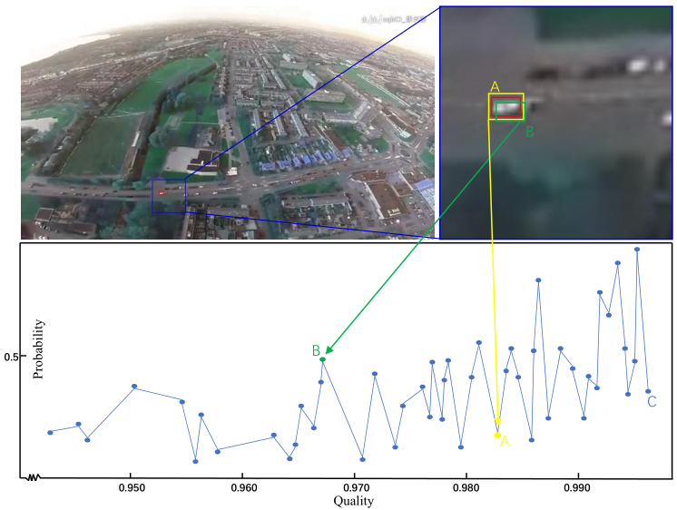

# TqDiMP

## Intro

TqDiMP proposed in this paper is a tracker for tracking the tiny target. Our investigation reveals that the proposal’s position is of greater importance relative to its size when regressing tiny objects.

  

## About
The  TqDiMPRQ has been uploaded to [Baidu Drive](https://pan.baidu.com/s/1oSAumAkVgYuwxtmHG1V2zw?pwd=1234 ). The code has been tested on Ubuntu 18.04, Python 3.8, Pytorch 1.4, cudatoolkit==10.0. Other questions please contact [jankin](jankin.mao@whu.edu.cn). The code is implemented based on [pytracking](https://github.com/visionml/pytracking). We would like to express our sincere thanks to the contributors.

